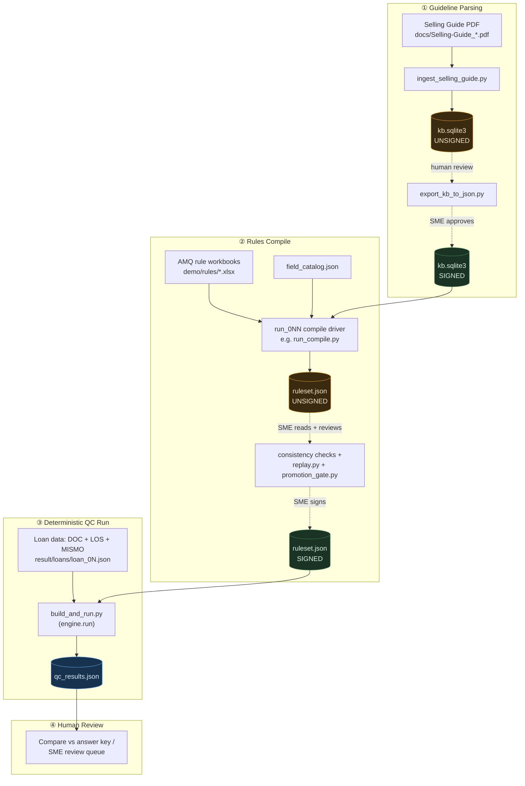

<!-- title: Mortgage QC Pipeline — Operator Runbook -->

# Mortgage QC Pipeline — Operator Runbook

**For explaining to the architect: how the guideline-parsing → rules-compile → QC-run pipeline actually works today, in `mortgage-qc-prod`.**

This reflects the code as it exists right now — including the parts that are still manual or missing. Where something doesn't exist yet, it's called out as a **gap**, not papered over.

---

## The pipeline, end to end



**Read this diagram as:** amber = unsigned/unreviewed artifact, green = signed/human-approved artifact, blue = the actual QC output. Nothing forces the amber→green step today — see [§5](#5-what-else-you-need-to-know-to-operate-this).

---

## 1 · Initializing guideline parsing + rules compile

There is **no single `init.py`**. This is two separate stages, each run as a standalone script.

### 1a. Parse the guideline PDF into a knowledge base

```bash
python3 p0/qc_engine/compiler/ingest_selling_guide.py
```

- **Input:** `docs/Selling-Guide_06-03-2026_highlighted.pdf` (1,188 pages)
- **What it does:** deterministic (no LLM) — runs `pdftotext` under the hood and slices the guide into citable `{source_document, citation, content}` sections.
- **Output:** `storage/knowledge_base/kb.sqlite3`
- **Requires:** `pdftotext` (poppler-utils) on your `PATH`.
- The script prints its own warning on completion: the corpus is written **unsigned** — it exists to *ground* rule interpretation later, not to originate new rule content ([non-negotiable #1](../CLAUDE.md) in the project's own words).

### 1b. Compile the AMQ rule workbook into a deterministic ruleset

There's no generic `compile.py <file>` command — every real compile to date has been a purpose-built driver script under `p0/compile_runs/run_0NN_*/`. The two live examples:

| Driver script | Scope | Compiled output |
|---|---|---|
| `p0/compile_runs/run_010_post_closing_only/run_compile.py` | Post-closing rows only (5,098 rows) | `result/rules/post_closing_only_ruleset.json` |
| `p0/compile_runs/run_008_comprehensive_8442/run_comprehensive.py` | All 6 programs (8,399 checks) | `result/rules/comprehensive_ruleset.json` |

```bash
cd p0/compile_runs/run_010_post_closing_only
python3 run_compile.py        # resumable — safe to re-run, checkpoints every 250 rows
```

- **Inputs:** `demo/rules/*.xlsx` (the real AMQ workbooks), `p0/qc_engine/field_catalog.json`, the signed KB from step 1a.
- **What it does:** one Bedrock `converse()` call per rule row (Claude, temp=0) → deterministic parse/clean → deterministic program-gate → assembles into a `Ruleset`.
- **Output:** `ruleset.json` locally, copied to the canonical `result/rules/` store alongside a `PROVENANCE.md` recording the exact command, cost, and SHA-256 hash.
- **To start a new compile scope** (e.g. a different rule subset), copy one of the `run_0NN_*` folders as a template rather than writing one from scratch — there's no framework class that wraps this for you yet.

**Architecture reference, read this before explaining the pipeline to anyone:** `docs/architecture/rule-compiler.md` — walks the exact stage sequence (CLASSIFY → GROUND → COMPILE → PARSE+CLEAN → PROGRAM-GATE → ASSEMBLE+SIGN).

---

## 2 · Triggering the deterministic QC process

Same pattern as compile — no single generic "run QC" command. Pick the driver that matches what you're trying to do:

| Goal | Command | What you get |
|---|---|---|
| Quick end-to-end sanity check | `cd p0 && python3 run_demo.py` | Runs 5 synthetic loans through the full pipeline in one shot |
| Run one real loan against the signed ruleset | `python3 p0/compile_runs/run_015_loan_01_comprehensive_qc/build_and_run.py` | `result/qc_results/loan_01_all.json` — full per-check verdicts + disposition |
| Batch: one ruleset against all 5 demo loans | `python3 p0/compile_runs/run_010_post_closing_only/run_against_loans.py` | One results file per loan |

Under the hood, every one of these calls the same deterministic core:

```python
p0/qc_engine/engine.py :: run(loan, ruleset, confidence_floor=...) -> RunResult
```

`RunResult` is keyed by `ruleset.sha256()` — so for any result you can always answer "which exact compiled rules judged this loan, byte for byte."

---

## 3 · Following the process in a log

Be aware this project does **not** use Python's `logging` module anywhere — everything is `print()`. So "the log" means two different things depending on what you need:

**A. Live progress while a script runs** — only works if you redirect it yourself; the scripts don't do this for you:
```bash
python3 run_compile.py > run.log 2>&1 &
tail -f run.log
```
(Past runs already have these sitting next to them, e.g. `p0/compile_runs/run_008_comprehensive_8442/run.log`.)

**B. The real structured audit trail** — this is what you'd actually show an auditor:
```bash
# written automatically by scripts that instantiate EvalLog(run_id)
cat storage/logs/<run_id>.jsonl
```
- Source: `p0/qc_engine/eval_log.py` — one JSON line per event, flushed immediately (crash-safe), including an explicit evidence chain (input → method → verdict) and cost/resolution-rate stats.
- Existing examples: `storage/logs/run_013_comprehensive_e2e_v6.jsonl`, `run_014_decision_narrative_panel.jsonl`.
- There's also a **hash-chained, tamper-evident** version for production-grade audit: `p0/qc_engine/audit.py` (each record hashes the previous one — SQLite today, designed to move to S3 Object Lock).
- For a human-readable walk-through of *why* one specific check passed or failed: `p0/eval_real/audit_trace.py :: build_examiner_trace(run_result, check_id)`.

⚠️ Note: `EvalLog` is opt-in per script, not automatic — if a driver script doesn't instantiate it, you only get the `print()` output for that run.

---

## 4 · Checking each stage's output is *correct*, independently

| Stage | Artifact to open | How to verify it | Command |
|---|---|---|---|
| **Guideline parsing** | `storage/knowledge_base/kb.sqlite3` | Export to human-readable JSON, read it, then sign it | `python3 p0/qc_engine/compiler/export_kb_to_json.py` → review → `KB.sign()` (`compiler/knowledge_base.py`) |
| **Rules compile** | `result/rules/*_ruleset.json` + its `PROVENANCE.md` | 1) structural lint, 2) prove a change doesn't silently flip old verdicts, 3) run the promotion gate | `consistency.py` / `pattern_flags.py` (structural) → `p0/qc_engine/replay.py` (regression) → `python3 p0/eval_synth/promotion_gate.py` (PROMOTE/BLOCK decision, writes `promotion_gate_result.json`) |
| **QC run** | `result/qc_results/*.json` | Compare against the planted answer key in the synthetic fixtures; run the proof suite | `demo/syn/loan 0N/00_Loan_Summary_And_Answer_Key.pdf` (ground truth) · `cd p0 && python3 tests/test_p0.py` (19/19 unit+integration) · `python3 harness.py 1000` (bit-exact determinism over 1,000 reruns) · `python3 prove.py` (LTV-boundary correctness demo) · `cd p0/eval_synth && python3 eval.py 5000` (scored synthetic eval at volume) |

If you only remember one command for "is the engine itself trustworthy": `python3 harness.py 1000` — it proves the *same* loan + *same* ruleset produces the *same* result 1,000 times in a row. That's the determinism claim, empirically, not asserted.

---

## 5 · What else you need to know to manage and operate this

**Environment, before anything will run:**
- Python 3.9 (the project-wide compatibility constraint — the ambient `python3` here is 3.9.6)
- `boto3` / `botocore` (Bedrock calls) and `openpyxl` (reading the `.xlsx` rule workbooks) — must already be installed; **there is no `requirements.txt` or `pyproject.toml` in this repo**, so these are tribal knowledge, not declared anywhere
- An AWS profile named `gordon-chan`, region `us-east-1`, hardcoded in compile scripts, calling model `us.anthropic.claude-sonnet-4-6`
- `pdftotext` (poppler-utils) on `PATH`, for step 1a only

**Real gaps — flag these to the architect directly, don't let them look solved:**
1. **No single "run everything" entry point.** Every real compile or QC run to date is a bespoke driver script copied and adapted from a previous `p0/compile_runs/run_0NN_*/` folder. If the architect asks "what's *the* script," the honest answer is "there isn't one yet — there's a pattern to copy."
2. **No enforced sign-off gate.** `engine.run()` will happily execute an unsigned ruleset — the amber→green step in the diagram above is a documentation/process discipline (recorded in `PROVENANCE.md` files), not something the code refuses to skip.
3. **`promotion_gate.py`'s PROMOTE/BLOCK exit code isn't wired into anything** — no CI, no Makefile, no pre-commit hook exist in this repo at all.
4. **No `logging` module, no dependency manifest.** Both are "tribal knowledge in script headers" today, not artifacts a new operator can just read.

**Where things live (so you're not hunting):**

| Path | What's there |
|---|---|
| `p0/qc_engine/` | The engine itself — `engine.py`, `ruleset.py`, `model.py` (3-source loan model), `mismo.py` |
| `p0/qc_engine/compiler/` | Everything for stage ① and ② — `compile_llm.py`, `knowledge_base.py`, `ingest_selling_guide.py` |
| `p0/compile_runs/run_0NN_*/` | The actual runnable drivers — one folder per historical compile/QC run |
| `p0/eval_synth/`, `p0/eval_real/` | The two eval harnesses — synthetic ground-truth and real-loan distribution |
| `result/loans/`, `result/rules/`, `result/qc_results/` | Canonical, git-tracked outputs — each folder has its own `PROVENANCE.md` |
| `storage/knowledge_base/`, `storage/logs/` | Generated stores — the KB sqlite file, the JSONL audit trails |
| `demo/rules/` | Real AMQ `.xlsx` workbooks — compile input |
| `demo/syn/` | 5 synthetic loans with planted answer keys — the eval fixtures |

**Best existing docs to hand the architect directly** (in priority order): `docs/architecture/rule-compiler.md` (the compile pipeline), `p0/README.md` (the 4-command determinism proof), `result/rules/PROVENANCE.md` + `result/qc_results/PROVENANCE.md` (exact repro commands for what's already been run), `p0/eval_synth/README.md`. There is **no root-level `README.md` or `RUNBOOK.md`** — this document is filling that gap.
