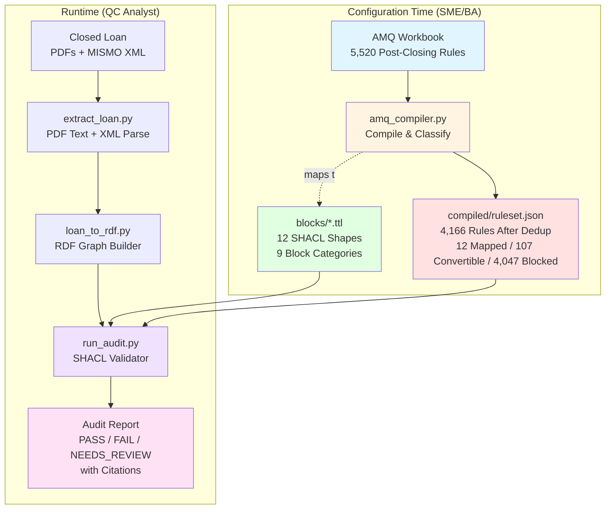
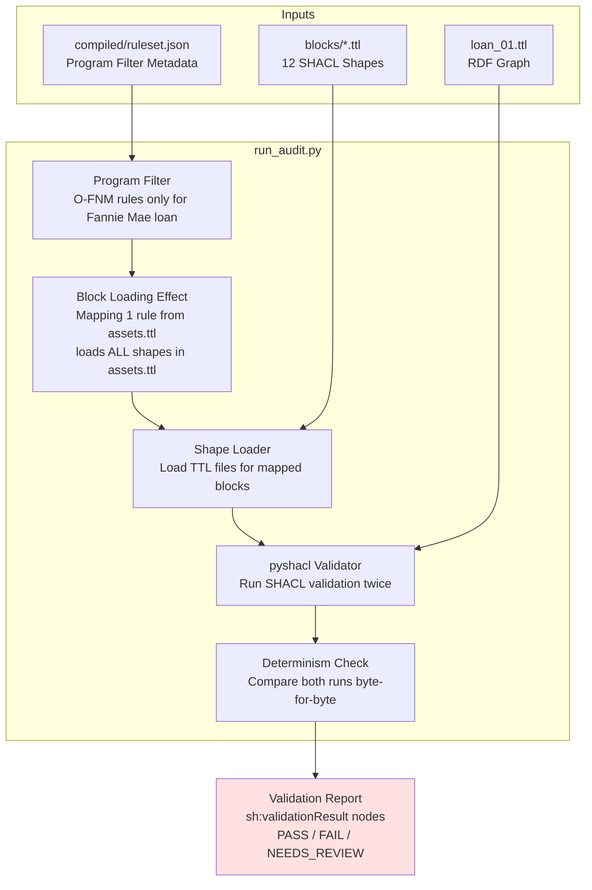
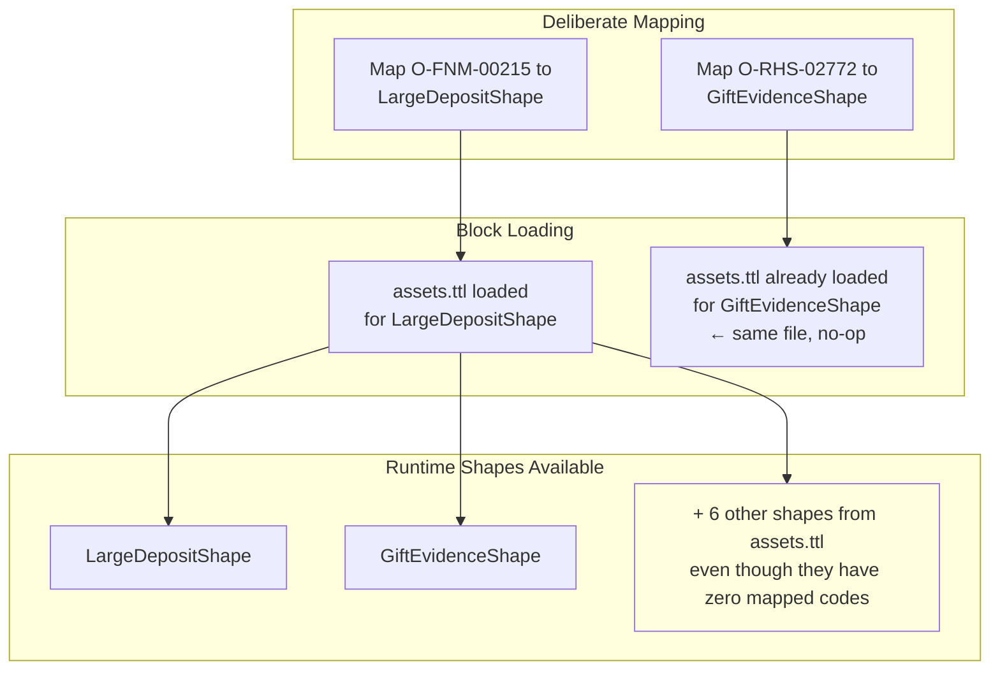
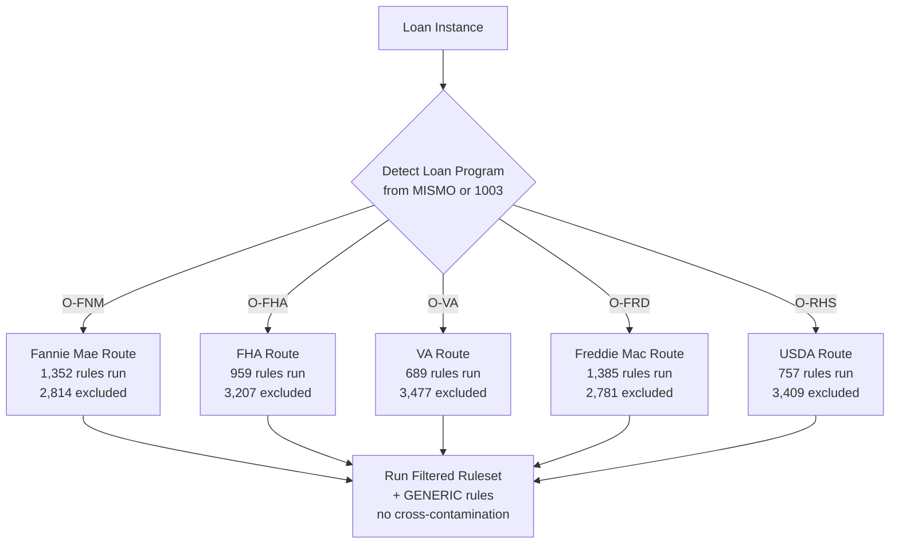
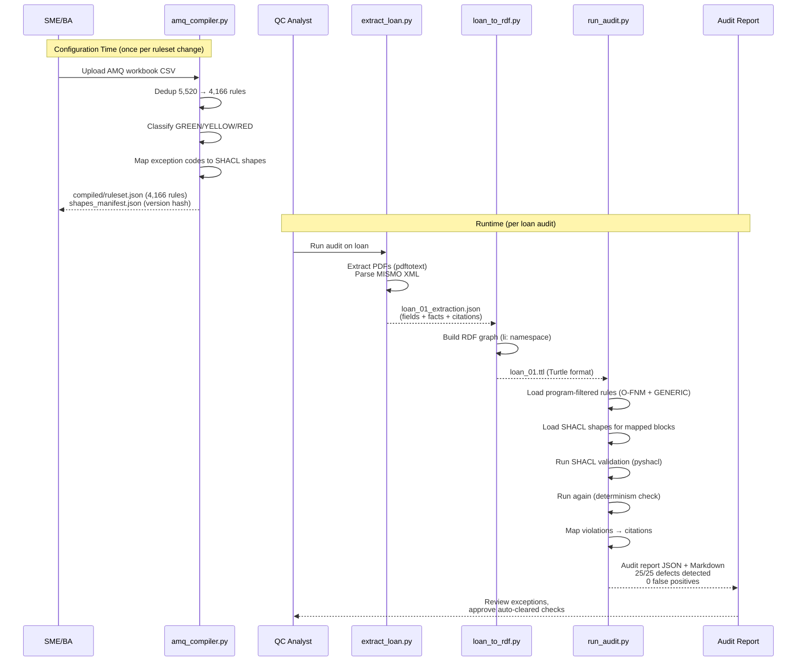
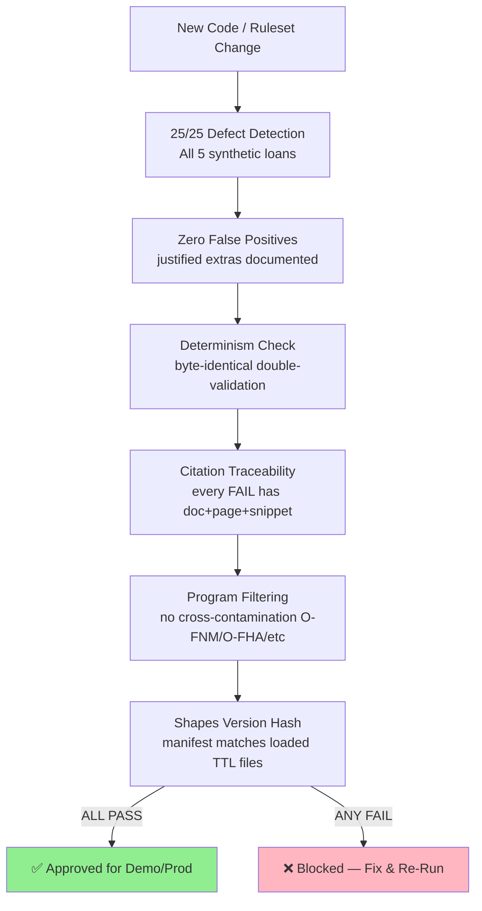
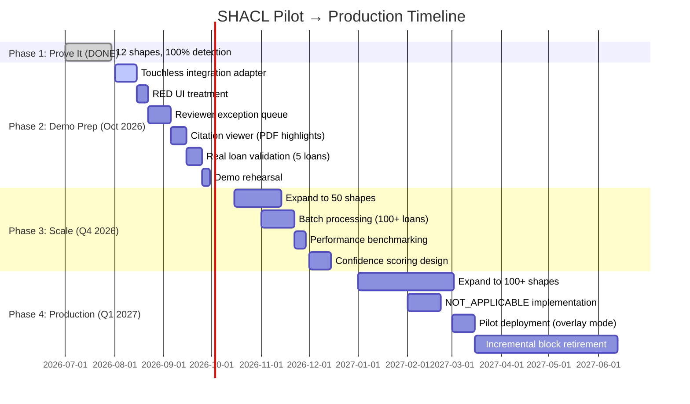

# SHACL QC Pilot Architecture — How It Works

**Version:** v3 (100% detection across 5 agencies)  
**Commit:** d8dbf5a  
**Date:** 2026-07-30

---

## Overview: Compile-Then-Run Architecture

The SHACL pilot implements a **deterministic, audit-ready mortgage QC engine** using a two-phase architecture: compile AMQ rules into SHACL shapes at configuration time, then execute those shapes deterministically at runtime.



**Key Insight:** The LLM works at configuration time (interprets AMQ → generates SHACL), not at runtime. Same ruleset + same loan → same results, every time.

---

## Phase 1: Configuration Time — AMQ Compilation

### Input: AMQ Workbook

**Source:** `src/doc/PF and PC Sept 2025 AMQs - Retail - Post-Closing.csv` (5,520 rows)

```mermaid
graph LR
    subgraph "AMQ Row Structure"
        QCode[Question Code<br/>O-FNM-15333]
        ECode[Exception Code<br/>O-FNM-59271]
        QText[Question Text<br/>"Were all IPC requirements met?"]
        RText[Response Text<br/>"Undisclosed IPCs..."]
        Category[Category<br/>"Assets"]
    end
    
    QCode --> Compiler
    ECode --> Compiler
    QText --> Compiler
    RText --> Compiler
    Category --> Compiler
    
    Compiler[amq_compiler.py]
    
    Compiler --> Dedup[Deduplication<br/>5,520 → 4,166<br/>By question+response tuple]
    Dedup --> Classify[Classification<br/>mapped / doc_presence /<br/>blocked_on_missing_fixture / unmapped]
    Classify --> YELLOW[YELLOW Split<br/>convertible vs blocked]
    YELLOW --> Output[compiled/ruleset.json]
```

### Classification Logic

```mermaid
flowchart TD
    Rule[AMQ Rule]
    
    Rule --> Check1{Exception code in<br/>MAPPED_SHAPES?}
    Check1 -->|Yes| GREEN[GREEN<br/>mapped]
    
    Check1 -->|No| Check2{Exception code in<br/>BLOCKED_ON_MISSING_FIXTURE?}
    Check2 -->|Yes| YELLOW1[YELLOW<br/>fixture_gap]
    
    Check2 -->|No| Check3{Doc-presence pattern?<br/>"not in file" + doc keyword}
    Check3 -->|Yes| YELLOW2[YELLOW<br/>doc_presence]
    
    Check3 -->|No| UNMAPPED[UNMAPPED<br/>needs triage]
    
    UNMAPPED --> Check4{Keyword scan}
    Check4 -->|SME terms| YELLOW3[YELLOW-blocked<br/>sme_clarification]
    Check4 -->|External terms| YELLOW4[YELLOW-blocked<br/>external_lookup]
    Check4 -->|Neither| YELLOW5[YELLOW-blocked<br/>other]
    
    style GREEN fill:#90EE90
    style YELLOW1 fill:#FFFFE0
    style YELLOW2 fill:#FFFFE0
    style YELLOW3 fill:#FFB6C1
    style YELLOW4 fill:#FFB6C1
    style YELLOW5 fill:#FFB6C1
```

**Current Distribution:**
- **12 GREEN** (0.3%) — hand-mapped SHACL shapes
- **107 YELLOW-convertible** (2.6%) — 16 fixture_gap + 91 doc_presence
- **4,047 YELLOW-blocked** (97.1%) — 539 SME / 16 external / 3,492 other

---

## Phase 2: Runtime — Loan Audit

### Step 1: Extraction

```mermaid
graph TB
    subgraph "Input Documents"
        PDF1[01_Final_1003_URLA.pdf]
        PDF2[02_Verification_of_Employment.pdf]
        PDF3[05_Bank_Statement_Wells_Fargo.pdf]
        PDF4[07_Title_Commitment.pdf]
        MISMO[09_Loan_Data_MISMO.xml]
    end
    
    subgraph "extract_loan.py"
        TextExtract[pdftotext<br/>PDF → Plain Text]
        Patterns[doc_patterns/*.json<br/>Regex Field Extractors]
        XMLParse[ElementTree<br/>MISMO XML Parser]
        
        TextExtract --> Fields[Extracted Fields<br/>employer_name, base_monthly_income,<br/>employment_start_date, etc.]
        XMLParse --> MISMOFields[MISMO Fields<br/>mortgage_type, property_value, etc.]
        
        Fields --> Citations[Citation Tracking<br/>doc_name, page, snippet]
        MISMOFields --> Citations
    end
    
    PDF1 --> TextExtract
    PDF2 --> TextExtract
    PDF3 --> TextExtract
    PDF4 --> TextExtract
    MISMO --> XMLParse
    
    Citations --> Output[loan_01_extraction.json<br/>{ fields: {...}, facts: {...}, docs: [...] }]
    
    style Output fill:#e1ffe1
```

**Key Feature:** Every extracted value carries `{doc_name, page, snippet}` — non-negotiable for audit traceability.

### Step 2: RDF Graph Construction

```mermaid
graph LR
    Extraction[loan_01_extraction.json]
    
    subgraph "loan_to_rdf.py"
        Builder[RDF Graph Builder]
        
        Builder --> Loan[li:loan_2025_0917_001<br/>rdf:type li:LoanInstance]
        Builder --> Fields[li:employer_name "TechStart Solutions"<br/>li:base_monthly_income "7916.67"<br/>li:employment_start_date_1003 "2018-03-15"]
        Builder --> Docs[li:document_present_final_1003 true<br/>li:document_present_voe true]
        Builder --> MISMO[li:mismo_mortgage_type "Conventional"<br/>li:mismo_property_value "425000"]
    end
    
    Extraction --> Builder
    Builder --> Graph[loan_01.ttl<br/>RDF/Turtle Format]
    
    style Graph fill:#e1f5ff
```

**Namespace:** `li:` (loan-instance) for all loan data predicates

### Step 3: SHACL Validation



**Determinism Guarantee:** Run twice on independently-built graphs, assert identical results.

### Step 4: Citation Mapping

```mermaid
graph LR
    subgraph "Validation Result"
        Violation[sh:Violation<br/>focusNode: li:loan_2025_0917_001<br/>resultPath: li:employment_start_date_1003<br/>value: "2018-03-15"]
    end
    
    subgraph "run_audit.py Result Mapper"
        Lookup[Citation Lookup<br/>Find original extraction.json entry]
        Resolve[Citation Resolver<br/>doc_name + page + snippet]
    end
    
    Violation --> Lookup
    Lookup --> Resolve
    
    Resolve --> Output["FAIL: EmploymentStartDateShape<br/>Employment start date mismatch —<br/>1003 states 2018-03-15 but VOE states 2019-05-01<br/><br/>Citations:<br/>• 01_Final_1003_URLA.pdf p.1<br/>  'Employment Start Date 03/15/2018'<br/>• 02_Verification_of_Employment.pdf p.1<br/>  'Date of Employment 05/01/2019'"]
    
    style Output fill:#ffe1f5
```

**Every FAIL includes:** Shape name, rule text, extracted values, document citations (name + page + snippet), AMQ check ID, Selling Guide citation.

---

## Block Loading Effect

**Discovery:** Mapping 1 rule from a block loads the entire block's TTL file.



**Velocity Multiplier:** Instead of mapping 4,166 rules one-by-one, map ~17 (one per AMQ category) to guarantee partial coverage across every block.

**Current Coverage:** 12 mapped rules trigger 11 shapes at runtime (some share TTL files) across 3 of 17 blocks (18%).

---

## Program Filtering (Agency Routing)



**Why This Matters:** O-VA rules don't fire on Fannie Mae loans. Program filtering prevents false positives and reduces runtime rules by 50–70%.

---

## Data Flow: End-to-End



---

## Standing Gates (Pre-Sign-Off Checklist)

Before any demo or production run, these gates MUST pass:



**Current Status (commit d8dbf5a):** ✅ All 6 gates PASS

---

## Architecture Decisions (Key Trade-Offs)

### 1. Compile vs. Runtime LLM

| Approach | Pros | Cons | Decision |
|----------|------|------|----------|
| **Compile** (this pilot) | Deterministic, auditable, zero per-run cost, SME validates before execution | Requires re-compile on rule change | ✅ **CHOSEN** |
| Runtime LLM | Flexible, no recompile | Non-deterministic (temp=0 mitigates but doesn't eliminate), $700–$3,500/run at scale, regulator can't audit the derivation | ❌ Rejected |

**Decision:** Non-Negotiable #1 from `CLAUDE.md` — determinism above all.

### 2. Block-Level vs. Shape-Level Loading

| Approach | Pros | Cons | Decision |
|----------|------|------|----------|
| **Block-level** (this pilot) | Velocity multiplier (map 1, get entire category), matches SME mental model | Coverage unpredictable (depends which shapes share TTL files) | ✅ **CHOSEN** |
| Shape-level | Precise control | Slower SME authoring (4,166 individual mappings) | ❌ Rejected |

**Decision:** Block = AMQ category (one TTL file). SME maps 1 rule → entire block runs.

### 3. Three Data Sources (Not Just PDFs)

| Source | Origin | Role | Why |
|--------|--------|------|-----|
| **PDFs** | Title company post-closing package | Source of truth | Signed, dated, legally binding |
| **MISMO XML** | Title company or LOS export | Structured supplement | Programmatic access to loan data |
| **LOS Export** | Loan Origination System | Pre-closing baseline | Cross-check for discrepancies |

**Decision:** Cross-compare all three — the value is reconciliation, not isolation.

---

## What's NOT Built (Honest Gaps)

### Coverage Gaps
- **12 of 4,166 checks mapped** (0.3%) — proof-of-concept, not production scale
- **3 of 17 AMQ blocks covered** (18%) — application, assets, income only
- **9 blocks unmapped** — data-validation, EPD, info-integrity, loan-documents, insurance, closing (partial), appraisal-1033, certification (partial), compliance

### Data Gaps
- **Initial URLA not extracted** — only final URLA (decision 015 identified this)
- **Co-borrower signature detection** — added in decision 015, but still gaps (loan 05 missing signature line)
- **Touchless integration** — synthetic PDFs only, no real Touchless JSON adapter yet

### UX Gaps
- **No reviewer queue UI** — audit output is JSON/Markdown, not interactive
- **No citation viewer** — doc+page+snippet in text, not highlighted PDF viewer
- **No confidence scoring** — neither prototype solved this (see `output/DEMO-UX-LESSONS.md`)

### Workflow Gaps
- **No RED → "Requires Expert Judgment" UI** — 409 RED rules identified (decision 026) but no UI treatment yet
- **No NOT_APPLICABLE status** — designed (decision 027) but not implemented
- **No batch processing** — runs 5 loans sequentially, not 500 in parallel

---

## Production Roadmap



**Next Immediate Steps (Pre-Demo):**
1. Get Touchless sample payload (loan #12607601215)
2. Build adapter if needed (1-2 days)
3. Implement RED UI treatment (1 week)
4. Test end-to-end with real loan (1 week)

---

## Key Files Reference

```
src/shacl_pilot/
├── amq_compiler.py           # Compiles AMQ CSV → ruleset.json
├── extract_loan.py           # Extracts PDFs+XML → extraction.json
├── loan_to_rdf.py            # Builds RDF graph → loan_XX.ttl
├── run_audit.py              # Runs SHACL validation, produces report
├── shape_manifest.py         # Versions SHACL shapes by content hash
├── selling_guide_index.py    # Parses Selling Guide TOC → citations
│
├── blocks/                   # SHACL shape definitions (9 TTL files)
│   ├── application.ttl       # 8 shapes (employment, title, signatures, etc.)
│   ├── assets.ttl            # 2 shapes (large deposit, gift evidence)
│   ├── credit_liabilities.ttl# 2 shapes (undisclosed liability, late payment)
│   ├── income.ttl            # 2 shapes (self-employed docs, etc.)
│   ├── property_appraisal.ttl# 5 shapes (comp distance, stale appraisal, etc.)
│   ├── underwriting.ttl      # 2 shapes (residual income, ratio waiver)
│   ├── product_specific.ttl  # 5 shapes (Amendatory, USDA, etc.)
│   ├── closing.ttl           # 1 shape (payoff discrepancy)
│   └── certification_delivery.ttl # 1 shape (NOV after closing)
│
├── compiled/                 # Compilation outputs
│   ├── ruleset.json          # 4,166 rules with metadata (SHA 6fa9840dc020)
│   ├── shapes_manifest.json  # Version hash (9a24f2e9b5c0)
│   ├── selling_guide_index.json # 386 Selling Guide topics
│   └── triage_*.json         # 7 block triage analyses (GREEN/YELLOW/RED)
│
├── decisions/                # 27 decision records
│   ├── README.md             # Decision index
│   ├── JOURNAL.md            # Chronological narrative
│   ├── 001-*.md through 027-*.md
│
└── out/                      # Audit reports + analysis
    ├── full_5loan_audit_latest.md # 100% detection report
    ├── current_state_summary.md   # GREEN/YELLOW/RED breakdown
    ├── green_only_audit_loan01.md # 60% baseline (superseded)
    └── TRIAGE-PACKET-*.md         # SME review packets (7 blocks)
```

---

**End of Architecture Documentation**
